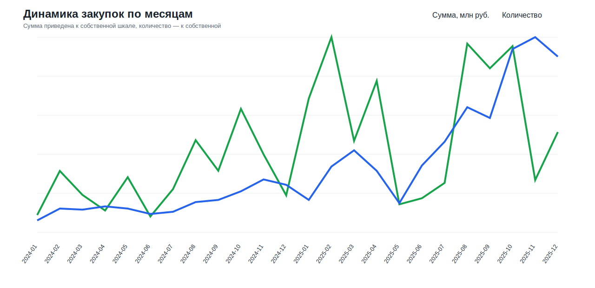
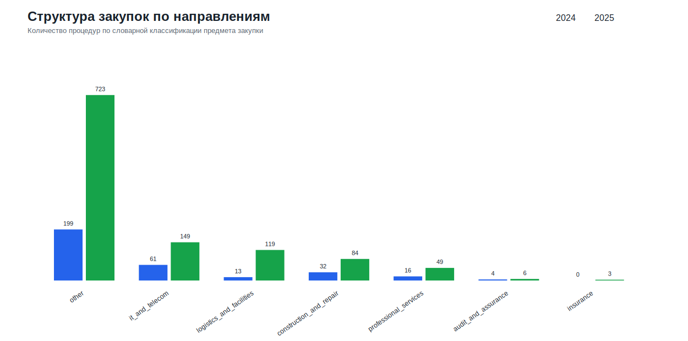
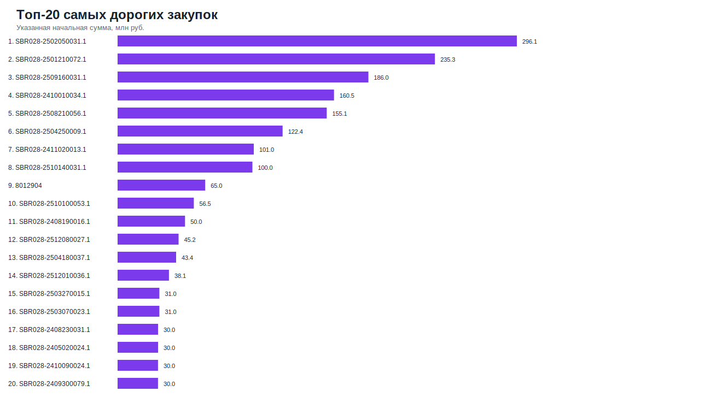
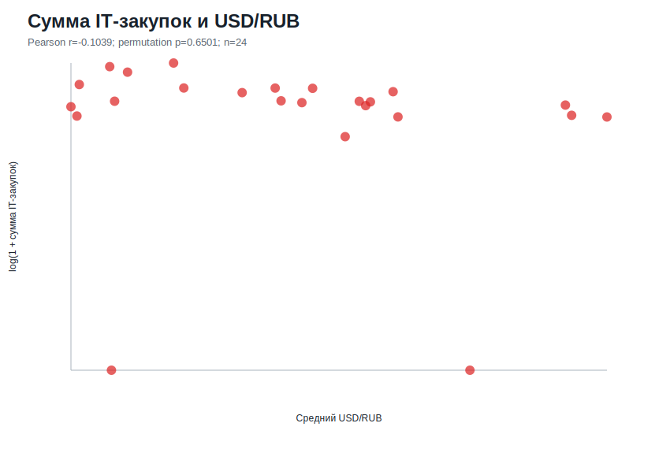
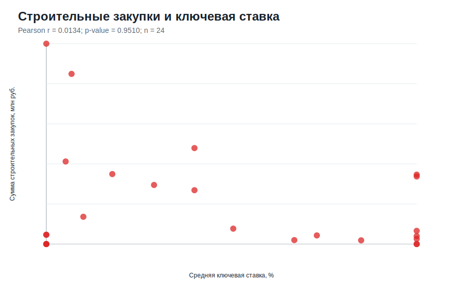
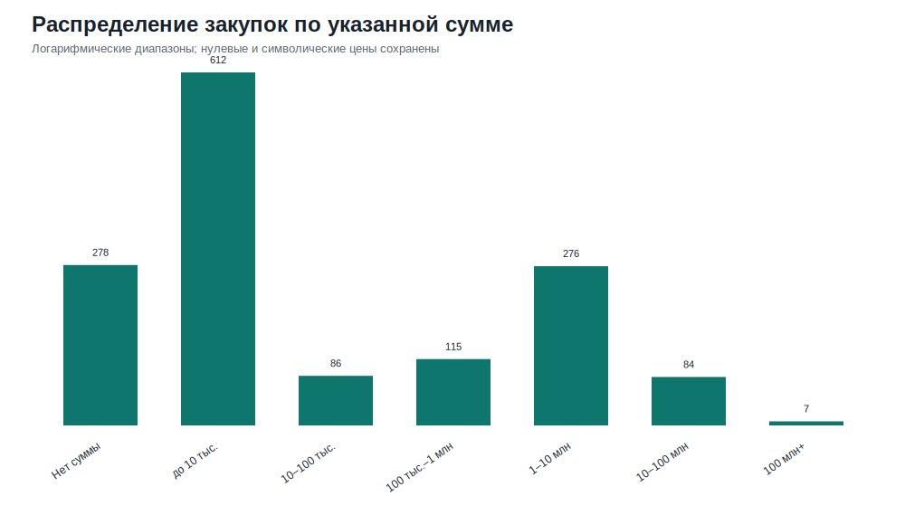
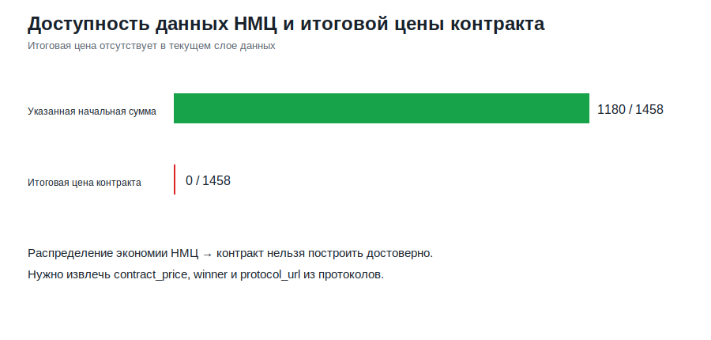
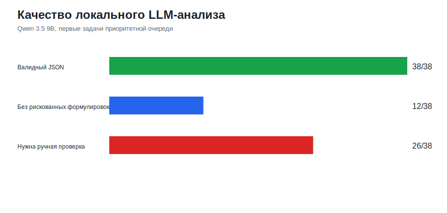

# Этап 4. Визуализация и выводы

## Динамика по месяцам

**Наблюдение:** Максимум количества пришёлся на 2025-11 (181 процедур), максимум суммы — на 2025-02 (413.6 млн руб.).

**Интерпретация:** Рост во второй половине 2025 года может сочетать сезонность закупочного цикла и более полное покрытие площадки.

**Значимость:** Месяцы-пики нельзя оценивать только по сумме: необходимо отделять массовую публикацию небольших процедур от единичных крупных лотов.

**Ограничение:** Дата публикации не отражает дату оплаты или фактического исполнения контракта.

## Структура направлений

**Наблюдение:** IT и телеком выросли с 61 до 149 процедур, указанная сумма — на 254.88%. Строительство выросло по количеству, но сумма изменилась на -5.24%.

**Интерпретация:** Рост количества не всегда означает рост денежного объёма; структура и масштаб процедур меняются по-разному.

**Значимость:** Направления необходимо сравнивать одновременно по количеству, сумме и медиане.

**Ограничение:** Словарная классификация не заменяет ОКПД2 и проверку технических заданий.

## Топ-20

**Наблюдение:** Самая крупная процедура — SBR028-2502050031.1 на 296.1 млн руб.

**Интерпретация:** Совокупная сумма чувствительна к небольшому числу крупных процедур.

**Значимость:** Для устойчивых выводов следует показывать медиану и проводить анализ с исключением крупнейших наблюдений.

**Ограничение:** Указанная сумма может быть НМЦ, лимитом, тарифом или единичной расценкой.

## IT и USD/RUB

**Наблюдение:** Для суммы IT-закупок связь незначима: r=-0.1039, p=0.6501. Для количества процедур получена отрицательная связь: r=-0.4957, p=0.0135.

**Интерпретация:** Синхронная месячная сумма не следует за курсом; количество может отражать сезонность или изменение покрытия, а не прямой валютный эффект.

**Значимость:** Статистическая проверка предотвращает ошибочный вывод по визуальному совпадению линий.

**Ограничение:** Всего 24 месяца; не проверены лаги, сезонность и состав импортной компоненты.

## Строительство и ключевая ставка

**Наблюдение:** Связь суммы строительных закупок с ключевой ставкой незначима: r=0.0134, p=0.951.

**Интерпретация:** В пределах двух лет закупочная активность определяется не только стоимостью денег, но и бюджетами, проектными циклами и отдельными объектами.

**Значимость:** Гипотеза не подтверждена текущей выборкой и не должна подаваться как установленная закономерность.

**Ограничение:** Двадцать четыре наблюдения недостаточны для устойчивой модели с лагами и контролем сезонности.

## Распределение сумм

**Наблюдение:** Сумма отсутствует у 278 процедур; распределение охватывает диапазон от символических значений до лотов свыше 100 млн руб.

**Интерпретация:** В одном поле смешаны разные экономические смыслы: полная НМЦ, тариф, единичная цена и незаполненное значение.

**Значимость:** Среднее значение без очистки и сегментации будет вводить в заблуждение.

**Ограничение:** Для нормализации нужны единица измерения, объём, тип цены и документы процедуры.

## НМЦ → контракт

**Наблюдение:** Начальная сумма доступна у 1180 процедур, итоговая цена контракта — у 0.

**Интерпретация:** Текущие поисковые карточки не содержат достаточного контрактного слоя.

**Значимость:** Экономию, снижение цены и эффективность конкуренции нельзя рассчитывать без итоговой цены.

**Ограничение:** Требуется извлечение протоколов, победителя, числа участников и суммы заключённого контракта.

## LLM

**Наблюдение:** Qwen сформировала 38 валидных JSON из 38, но 26 ответов требуют ручной проверки формулировок.

**Интерпретация:** Модель хорошо структурирует текст, но склонна усиливать риск-флаги до неподтверждённых предположений.

**Значимость:** LLM полезна как черновик и инструмент приоритизации, а не как источник фактов о нарушениях.

**Ограничение:** Обработано только 8,41% приоритетной очереди; выборка неслучайная.
